# Objectives

The overall objective is to relate nurse staffing to patient outcomes, and in particular the **patient experience time** (PET), **time to triage** (TTT) and the **wait to be seen time** (WBS). Staffing is reflected in terms of the actual, rostered, and required staff levels for the same period, for both RNs and HCAs. 

The key analytical challenge is that the data are inherently multilevel. The unit of observation in the study is the patient-visit, meaning that there are multiple visits per patient and so the patient-visits are not independent. Further, staff levels are measured for both 24 hour periods and shifts, so that patients and patient-visits are also clustered within these time periods. Things are further complicated by the fact that patient-visits can and do span across multiple periods (shifts or 24 hour periods). I suspect that we will have to make some simplifying selections and assumptions, such as only considering first visits, or assuming that patient-visits are only linked to the time-period they enter into. 

The other challenge is to account for the effects of nurse staffing **relative** to actual needs for that time-period. This is reflected in some degree in the "required" staff levels, but might also need to consider the specific case-mix of patients in the ER for that period, as well as the trolley count, day of the week, etc. 

# Units of observation

There are a total of 121966 observations (rows) in the dataset, which describes 70870 individual patients. 

Patients can have multiple visits to the ER (with the visit order recorded in `data$visit`). Their arrival times to the ER are logged and range from 2018-01-01 00:12:00 to 2020-04-01 00:04:00.


The rows of the dataset can then be uniquely identified by two columns: `patient_code` and `visit` (or `ed_arrive_date_time`). 


Some patients had many visits (up to 220), though most only had one (58.1%), and 89.5% had 5 or fewer. 

Figure: Distribution of patient visits

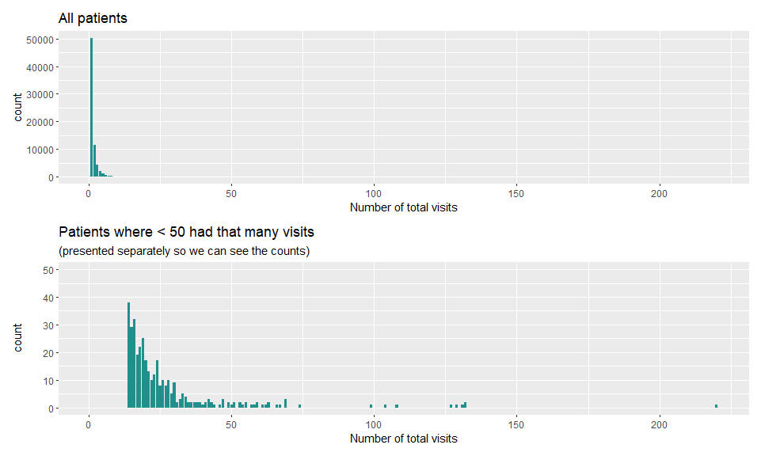<!-- -->

# Patient-visit level characteristics

Some patient-visits are characterized by a variable called `new_attendances`. A "new attendance" is distinguished from "returns", which was any attendance that wasn't a "scheduled return" or an "other return". Of the 121966 patient visits, 80.53% were new attendances (i.e. not returns), and 100% of first visits were also new attendances (**QUERY**: is this a function of how new attendances and returns were defined based on dates in the database, or is this also by design?)   


## Key Outcomes

The main outcomes, measured at the patient-visit level, are based on 4 key date-times:

Arrival to ER -> Triage -> Seen -> Leave ER

We want to plot these times to see if they make sense. 

First, let's see if they are all in the right order. In the plot below, I've taken every patient-visit, selected the 4 events of interest (Arrival, Triage, Seen, Discharge), and ordered them by their recorded date-times.

Figure: Observed order of key time-points

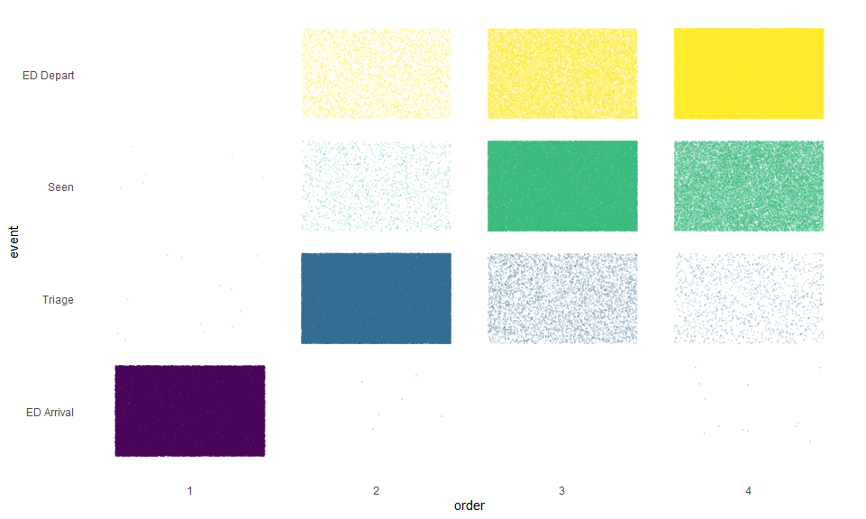<!-- -->

In the plot above, each point is patient-visit-time (there are so many they look like solid blocks on color in some squares). What it shows is that ED arrival is always first (except for 6 barely visible dots there in the 2nd position on the x axis). Triage is *almost* always second (almost all the dots for triage times are in the order = 2 square, but a few are found in 3rd or 4th order); and Seen and Discharge mostly fall into the 3rd or 4th positions, but not always. 

It is important to note the percentage of missing values for each key event date-time:

Figure: Percent missing for each key event

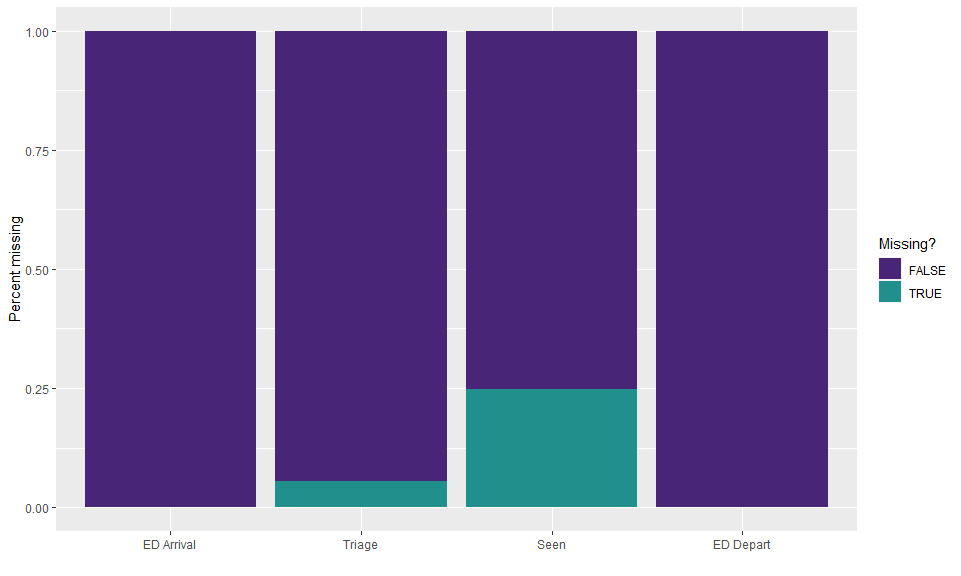<!-- -->

Table: Percent missing for key events (corresponding to the plot above)


|var        | no_miss|  miss| pct_miss|
|:----------|-------:|-----:|--------:|
|ED Arrival |  121954|    12|     0.01|
|ED Depart  |  115364|  6602|     5.41|
|Seen       |   91644| 30322|    24.86|
|Triage     |  121914|    52|     0.04|

So virtually everyone has an arrival and departure time, while the vast majority have a triage time, and most have a seen time. 


Now we consider overall patterns of missingness and the degree to which key date-times were in the correct order across all the patient-visits. There were 87924 patient-visits where there were no missing date-times and they were all in the correct order (labeled **A/T/S/D Correct**; 72.09% of the total database); and another 25042 patient-visits where there were no missing date-times for arrival, triage, and discharge, and they were all in the correct order (labeled **A/T/D Correct**; 20.53% of the total database). The counts for the rest are given in the plot below. 

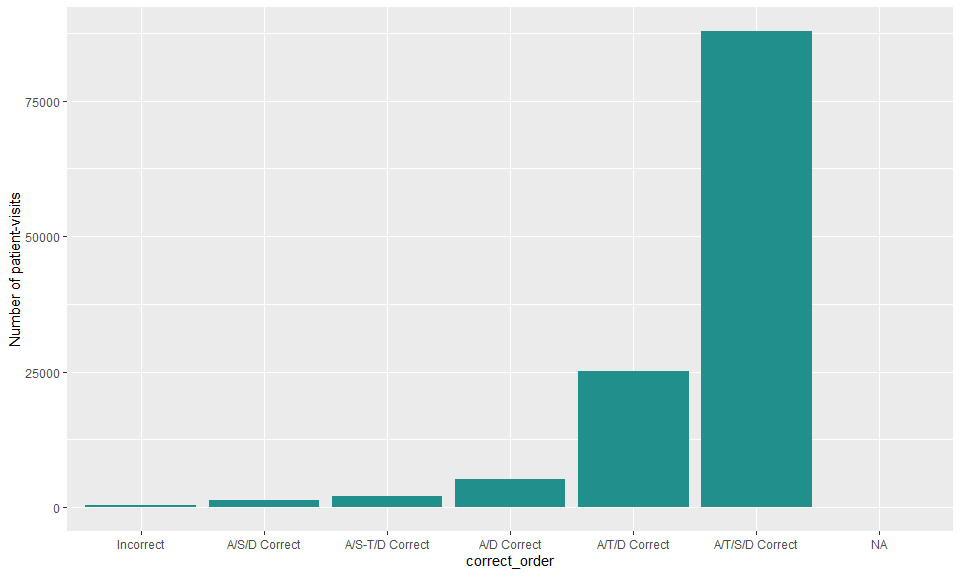<!-- -->

These match up with "not triaged" status. 

Figure: Relationship between triage status and date-time patterns (proportional and absolute counts)

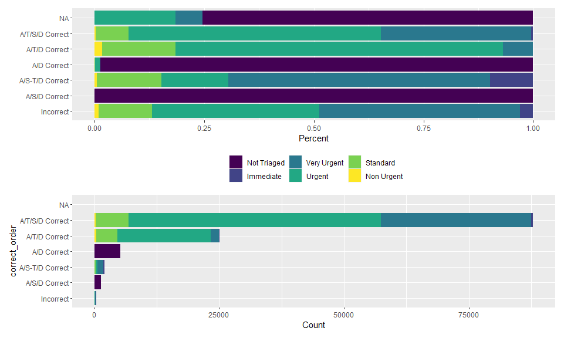<!-- -->

Figure: Timing for for patient-visits where key date-times were out of order

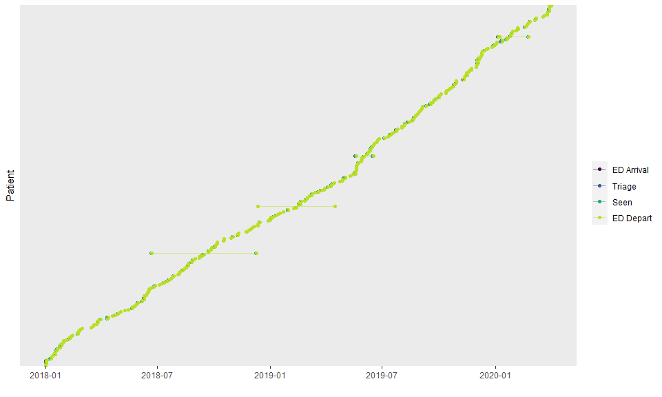<!-- -->

You can see that for most of these patient-visits the date-times all sit on top of each other (at this scale). We will explore the actual time differences below. 

Here is what these same data look like for the first 100 patient-visits that were first visits and that have all four key date-times in the expected order. 

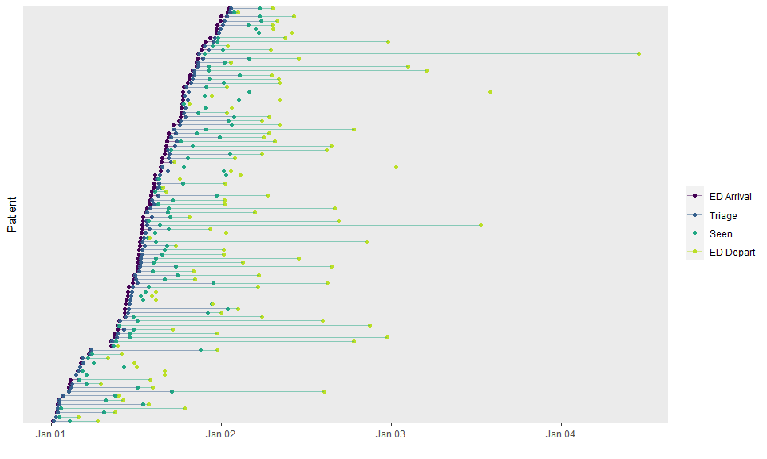<!-- -->

Table: Distributions of key timespans


|Variable                | Observations|Mean SD    |Median [IQR]    |(Min, Max)   |
|:-----------------------|------------:|:----------|:---------------|:------------|
|arrive_to_triage_hours  |       115352|0.5 ± 0.5  |0.3 (0.1, 0.7)  |(0, 17.2)    |
|arrive_to_seen_hours    |        91632|3.6 ± 3.9  |2 (0.8, 4.9)    |(-0.2, 45.4) |
|triage_to_seen_hours    |        90246|3.1 ± 3.8  |1.5 (0.5, 4.4)  |(0, 29.4)    |
|seen_to_discharge_hours |        91643|8.8 ± 11.4 |4.3 (1.9, 11.1) |(0, 230.9)   |

The data above include everyone, including the small numbers of patients with out of order date-times, hence the negative value for arrive-to-seen time. 

Figure: Length of key timespans across all patient-visits (first 24 hours)

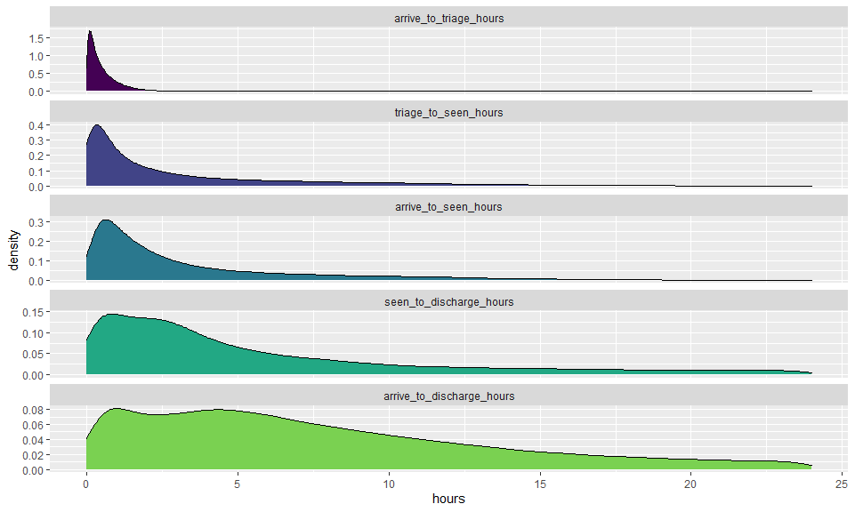<!-- -->

## Other patient-visit level variables


|Variable                       |Observations |Mean SD       |Median [IQR] |(Min, Max) |
|:------------------------------|:------------|:-------------|:------------|:----------|
|age_at_admission               |121551       |47.9 ± 20.2   |45 (31, 63)  |(1, 103)   |
|gender                         |121966       |              |             |           |
|Male                           |             |56802 (46.6%) |             |           |
|Female                         |             |65160 (53.4%) |             |           |
|Not Reported                   |             |4 (0%)        |             |           |
|mode_of_arrival                |121828       |              |             |           |
|Dublin Fire Brigade Ambulance  |             |32255 (26.5%) |             |           |
|Eastern Health Board Ambulance |             |3765 (3.1%)   |             |           |
|Garda                          |             |337 (0.3%)    |             |           |
|Helicopter                     |             |10 (0%)       |             |           |
|Other                          |             |4 (0%)        |             |           |
|Other Ambulance                |             |284 (0.2%)    |             |           |
|Own                            |             |85050 (69.8%) |             |           |
|Public Transport               |             |123 (0.1%)    |             |           |
|triage_category                |121966       |              |             |           |
|Not Triaged                    |             |6602 (5.4%)   |             |           |
|Immediate                      |             |674 (0.6%)    |             |           |
|Very Urgent                    |             |33137 (27.2%) |             |           |
|Urgent                         |             |69738 (57.2%) |             |           |
|Standard                       |             |11066 (9.1%)  |             |           |
|Non Urgent                     |             |749 (0.6%)    |             |           |

Referral and discharge will probably need some further categorizing to be useful. 

Figure: Referral types

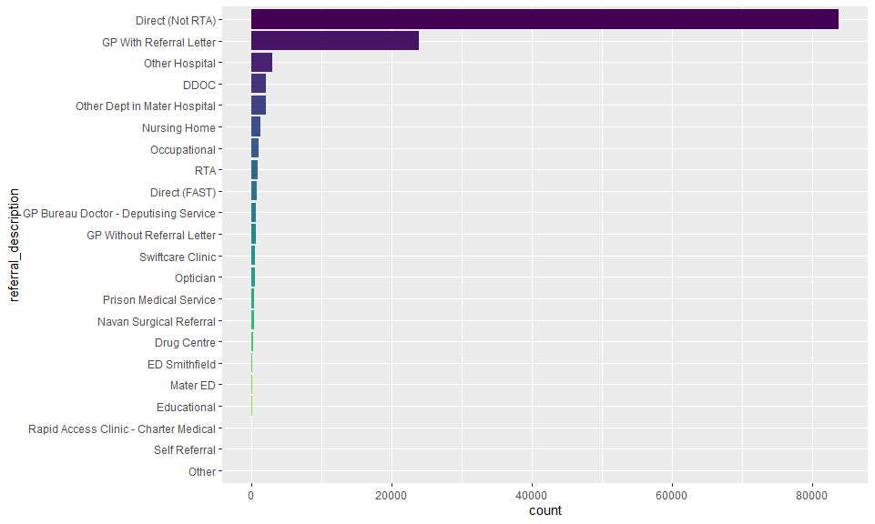<!-- -->

Figure: Discharge destination

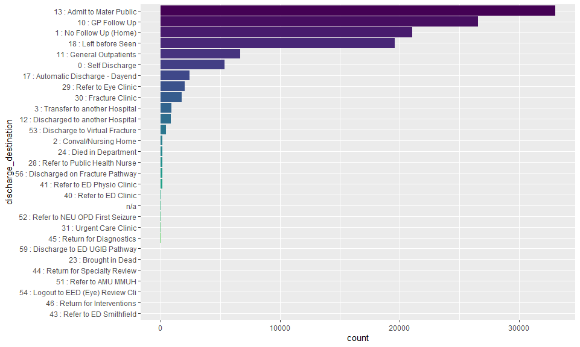<!-- -->

Does "left before seen" match up with expected date-times?


```
## 
##       Incorrect   A/S/D Correct A/S-T/D Correct     A/D Correct   A/T/D Correct 
##              15              10               5            3281           14060 
## A/T/S/D Correct 
##            2236
```

So some people who were discharged without being seen also have date-times for being seen (but only about 10% of them). 


# ER level factors

As noted above, each row in the dataset is a patient-visit, and this clustering of visits within patients needs to be accounted for in any analysis (i.e. patient-visits are not independent of one another). However, we also have another level of dependence, which is that patient-visits are also clustered over time, so that concurrent patient visits are more likely to share an environment characterized by a variety of time-varying factors including nurse staffing levels and trolly numbers.

## Shift vs 24 hour period

One way to capture is dependency is to consider patient-visits as nested within shifts. As such there is a `shift_code` in the dataset. These codes denote day and night shifts, and then a number that is generally in order with `ed_arrive_date_time`, but not always, as the plots below illustrate. Overall, there were 1643 shifts in the dataset, of which 821 were day shifts (one fewer than the number of night shifts). 


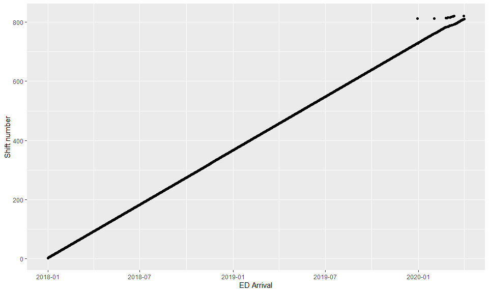<!-- -->

Zoom in where things fall our of order:

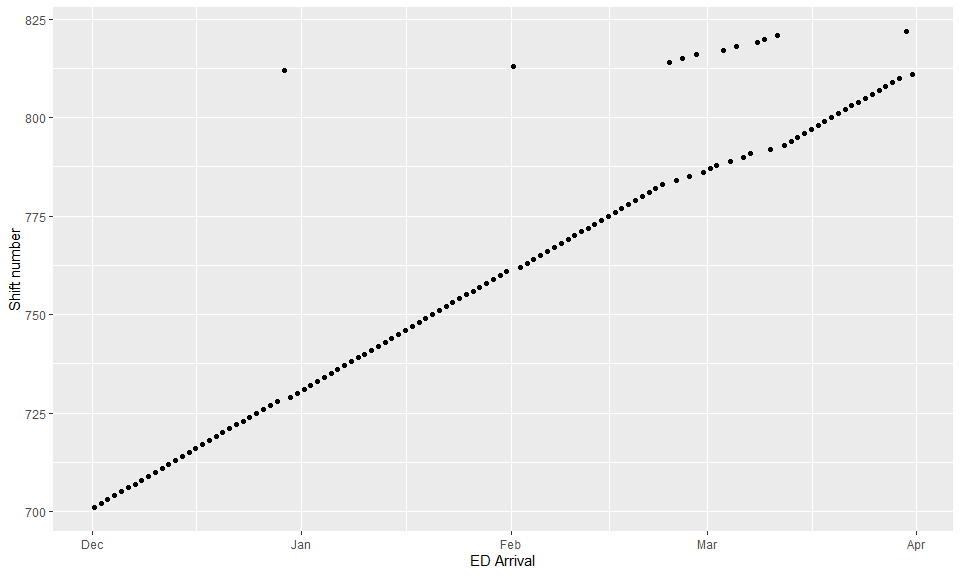<!-- -->

**QUERY**: Is this discrepancy something that needs to be resolved?

Everything is in order for the 24 periods.

## Nursing staff levels

### Shift

Nursing levels are described in various ways and are consistently linked to the shift code.


Figure: Distribution of nursing levels within shifts 

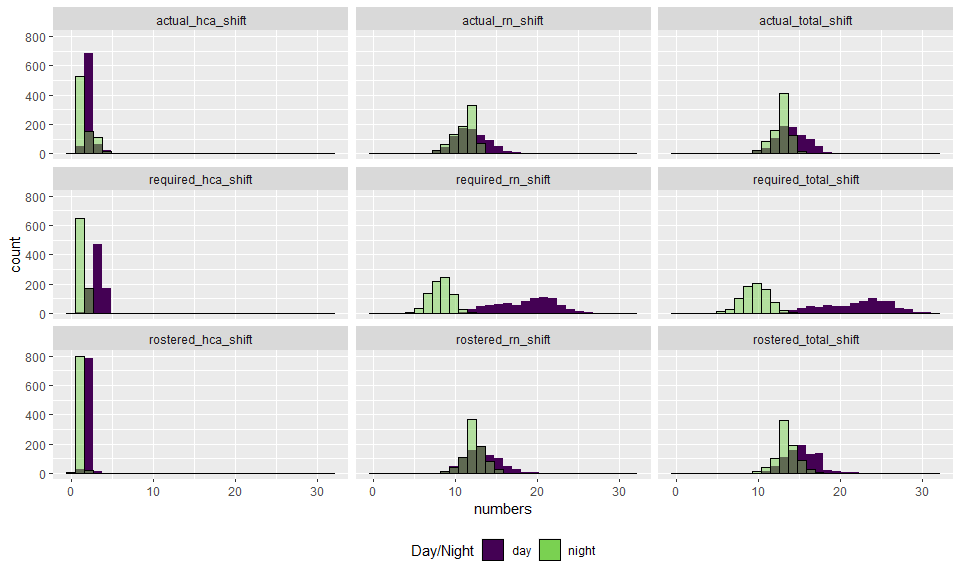<!-- -->

### 24 hour periods


Figure: Distribution of nursing levels within 24 hour periods 

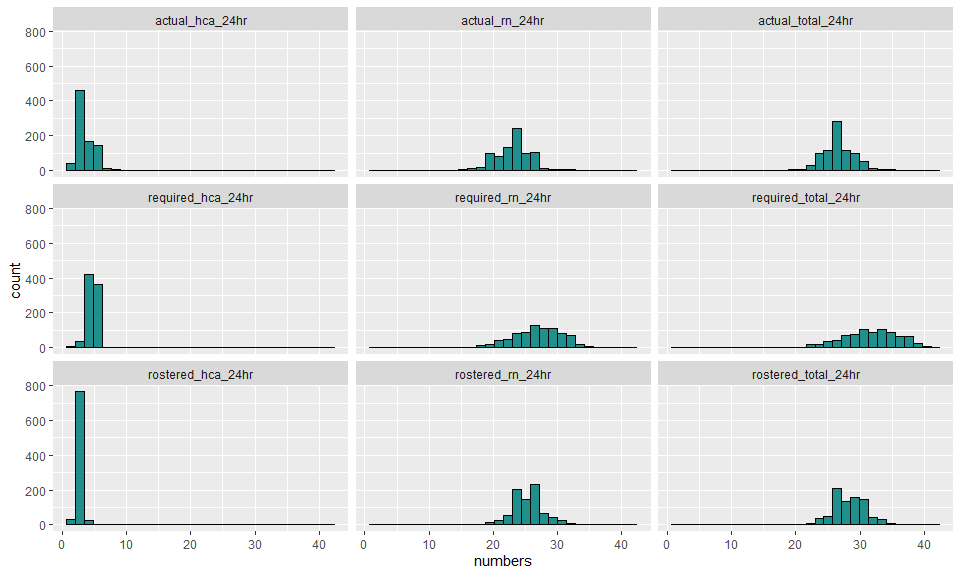<!-- -->

## Trolley GAR

There is also information on the trolley count ([trolley GAR](https://www.hse.ie/eng/about/who/acute-hospitals-division/emergency-departments/)) that may help explain staffing levels relative to needs. The challenge of measuring staffing levels relative to needs is probably the crux of the analysis. 


```
## 
## System: Windows 10 x64 build 18363
## Nodename: DESKTOP-JKQ7LTN, User: Darren
## Total Memory: 16168 MB
## 
## R version 4.0.3 (2020-10-10) 
## x86_64-w64-mingw32/x64 (64-bit) 
## 
## Loaded Packages: 
##  knitr (1.30), testthat (2.3.2), patchwork (1.0.1), flextable (0.5.11), viridis (0.5.1), viridisLite (0.3.0), forcats (0.5.0), stringr (1.4.0), dplyr (1.0.2), purrr (0.3.4), readr (1.4.0), tidyr (1.1.2), tibble (3.0.4), ggplot2 (3.3.2), tidyverse (1.3.0), descr (1.1.4)
```

